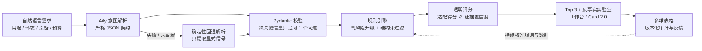

# PolyPilot — Polymaker AI Material Advisor

[](https://github.com/DoTrungHuy/Polymaker/actions/workflows/ci.yml)

> **AI 负责听懂，规则负责守住边界，证据负责解释。** — Evidence before answers.

<!-- TODO(截图): 本地运行工作台后，截取包含“双评分环 + 为什么不是它”面板的界面，
     保存为 docs/assets/workbench.png，然后取消下一行注释：
 -->

PolyPilot 是一个面向 3D 打印场景的可解释 AI 选材顾问，也是飞书「2026 AI 未来人才计划」Polymaker 赛题的独立参赛项目。它把自然语言需求转为结构化约束，用确定性规则完成设备兼容性过滤和 Top 3 排序，并为每条结论提供打印条件、限制和官方来源；在飞书中，请求、版本、结果与反馈还能沉淀为 Polymaker、经销商和技术支持可复用的决策记录。

> Independent competition entry. This project is not affiliated with, endorsed by, or an official product of Polymaker.

## 决策管线



AI 只出现在第一环。排除、评分和解释全部由已审核数据和确定性规则完成，同一输入永远得到同一结论。

## 与 Polymaker 官方 Web App 的关系

Polymaker 官方 Web App 已经提供用途推荐、材料对比、打印条件过滤、可分享视图、AI 问答和大量切片配置。PolyPilot 不复刻这些能力，也不把官方产品简化成普通聊天工具。我们的增量集中在三件事：

1. **可审核硬约束**：只有已审核数据能够参与排除和评分，未知信息不能默认通过。
2. **反事实解释**：不仅回答“选什么”，还能解释“为什么不是它、什么真实条件变化会改变答案”。
3. **飞书原生组织闭环**：Aily 解析意图，Card 2.0 承载证据与反馈，多维表格保留版本化决策记录，用于复盘和校准。

## 对 Polymaker 的试点价值

- 减少错误选材造成的重复检索、打印失败和支持沟通成本。
- 为经销商与技术支持提供条件、证据和版本一致的推荐口径。
- 将“场景—约束—材料—反馈”沉淀为可分析数据，为支持内容和产品组合优化提供线索。
- 以人工检索比较 30–60 分钟作为**待验证基线假设**，目标把单次选材决策压缩到 5 分钟内；所有业务收益必须在外部试点中实测，当前不作为既成结论。

## 为什么不是普通聊天机器人

- AI 只负责意图理解；Pydantic 和规则引擎负责最终决策。
- 信息不足时只问当前影响最大的一件事，不强行推荐。
- 喷嘴、热床、封闭仓、耐磨喷嘴、户外、柔性和温度属于硬约束。
- 适配得分与证据置信度分开显示，得分不是安全概率。
- 可选择任一被排除材料，查看“为什么不是它”和进入候选所需的最小条件变化。
- 医疗、食品接触、压力容器和安全承重用途必须转人工复核。

## 反事实实验室：一个真实例子

用户想打一个车内手机支架（环境温度 80 °C），想知道为什么 PETG 不在候选里。以下是当前代码库对 `POST /api/v1/decision-lab/POLYMAKER_PETG` 的真实返回（节选，`ruleset 1.1.0 / dataset 2026.07.17-gold12`）：

```jsonc
{
  "status": "change_conditions",
  "blocking_rules": [
    { "rule_id": "R04_TEMPERATURE_MINIMUM",
      "reason": "官方热性能参考值低于用户明确的环境温度。" }
  ],
  "required_changes": [
    { "field": "max_use_temperature_c",
      "label": "验证更低的实际环境温度",
      "current_value": 80.0,
      "required_value": 70.0,   // 80 → 70：官方热性能参考值
      "user_controllable": false }
  ],
  "feasible_after_changes": true,
  "projected_fit_score": 88,          // 条件满足后的重新评分
  "projected_evidence_confidence": 100,
  "evidence_refs": [
    { "url": "https://wiki.polymaker.com/.../polymaker-tm-petg-new",
      "accessed_at": "2026-07-17" }
  ]
}
```

系统不说“PETG 不行”，而是说：阻断它的是哪条规则、当前值和门槛值各是多少、这个条件是设备可调还是必须按真实用途确认、条件改变后它会得到什么分数——并附上官方来源。

## 当前完成度

- React + TypeScript 响应式选材工作台
- FastAPI v1 接口与 OpenAPI 文档
- 12 条带官方来源的代表材料数据
- 30 个固定金标准评测场景
- 23 项后端自动化测试，当前固定回归基准为 30/30
- 反事实决策实验室：阻断规则、条件变化和变化后重新评分
- 飞书 Aily 同步 Skill API 适配器与确定性安全回退
- 飞书机器人 Card 2.0 结果卡片、事件回调和卡片动作契约
- 飞书多维表格审计适配器；未配置时写入本地 SQLite
- Vercel 单仓库部署配置与 GitHub Actions

真实飞书闭环需要赛事租户的 App ID、App Secret、Aily Skill ID 和多维表格 Token。仓库不包含任何真实密钥；当前适配器完成不等于真实租户联调完成。

## 试点验收目标

| 指标 | 验收线 |
| --- | ---: |
| 硬条件违规材料排除率 | 100% |
| 高风险场景人工升级率 | 100% |
| 推荐结论证据引用覆盖率 | 100% |
| 30 个金标准场景 Top 3 或状态命中率 | ≥ 80% |
| Aily 非法输出安全回退率 | 100% |
| 单次选材流程目标时间 | < 5 分钟 |

当前 30/30 是仓库内固定回归基准，用于证明规则稳定性，不代表真实世界安全认证或独立专家准确率；“人工检索比较 30–60 分钟”是待外部试点验证的基线假设。

## 快速运行

环境：Python 3.12+、Node.js 24+。

Windows（PowerShell）：

```powershell
python -m venv .venv
.\.venv\Scripts\python -m pip install -e ".[dev]"
npm --prefix web install

# 终端 1
.\.venv\Scripts\python -m uvicorn polypilot.api:app --reload

# 终端 2
npm --prefix web run dev
```

macOS / Linux：

```bash
python3 -m venv .venv
.venv/bin/python -m pip install -e ".[dev]"
npm --prefix web install

# 终端 1
.venv/bin/python -m uvicorn polypilot.api:app --reload

# 终端 2
npm --prefix web run dev
```

打开：

- 产品界面：`http://127.0.0.1:5173`
- API 文档：`http://127.0.0.1:8000/docs`
- 健康检查：`http://127.0.0.1:8000/api/health`

## API

| 方法 | 路径 | 用途 |
| --- | --- | --- |
| GET | `/api/health` | 版本、材料数量和 Aily 模式 |
| POST | `/api/v1/intent/parse` | Aily 或安全回退意图解析 |
| POST | `/api/v1/recommendations` | 确定性选材决策 |
| POST | `/api/v1/decision-lab/{key}` | 解释目标材料的阻断规则与最小条件变化 |
| GET | `/api/v1/materials` | 材料和字段级证据 |
| GET | `/api/v1/materials/{key}` | 材料详情 |
| POST | `/api/v1/feedback` | 推荐反馈 |
| POST | `/api/integrations/feishu/events` | 飞书事件回调 |
| POST | `/api/integrations/feishu/card-actions` | Card 2.0 动作回调 |

## 验证

Windows（PowerShell）：

```powershell
.\.venv\Scripts\python scripts/check_data.py
.\.venv\Scripts\python scripts/evaluate_gold.py
.\.venv\Scripts\python -m pytest -q
.\.venv\Scripts\python -m ruff check .

npm --prefix web run lint
npm --prefix web run test
npm --prefix web run build
```

macOS / Linux：

```bash
.venv/bin/python scripts/check_data.py     # PASS 12 approved materials
.venv/bin/python scripts/evaluate_gold.py  # Gold benchmark: 30/30
.venv/bin/python -m pytest -q              # 23 passed
.venv/bin/python -m ruff check .

npm --prefix web run lint
npm --prefix web run test
npm --prefix web run build
```

## 数据边界

仓库不重新发布 Polymaker TDS/SDS PDF，只保存结构化事实、适用条件、访问日期和官方链接。热性能字段可能来自 HDT、玻璃化温度或无载热稳定描述；系统会显示具体测试口径，它们不能直接等同于打印成品的安全工作温度。

详见：[开题补充材料](output/pdf/PolyPilot_开题补充材料.pdf)、[数据许可](DATA_LICENSE.md)、[架构说明](docs/architecture.md)、[飞书接入](docs/feishu-setup.md)、[评测方法](docs/evaluation.md)、[前置调研依据](docs/research-evidence.md)、[比赛交付清单](docs/submission-checklist.md)。

## License

Code is licensed under the [MIT License](LICENSE). External product names, documents, and source data remain the property of their respective owners.
