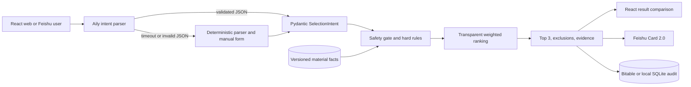

# Architecture

## Trust boundaries

- The browser never receives Feishu secrets.
- Aily output is untrusted until Pydantic validation succeeds.
- Only `approved` material profiles participate in decisions.
- Unknown thermal evidence is not treated as a pass.
- The deterministic engine is the only component allowed to produce the final ranking.
- Online persistence uses Bitable; local development uses ignored `.local/` SQLite.

## Deployment

Vercel serves `web/dist` and routes `/api/*` to the FastAPI function in `api/index.py`. The decision core is stateless; versioned material data ship with the repository. No Docker or production SQL server is required for v1.
