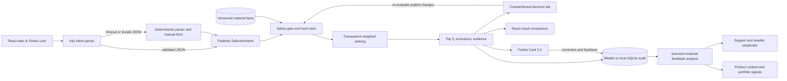

# Architecture

The final two nodes describe the external pilot and operating model, not a claim that Polymaker production systems are already connected.

## Product layers

- **Official capability context**: the Polymaker Web App already covers discovery, comparison, application filtering, AI assistance and slicer profiles; PolyPilot does not reproduce it.
- **Decision layer**: approved evidence, safety gates, hardware/environment hard constraints, transparent ranking and counterfactual traces create a reviewable recommendation.
- **Collaboration layer**: Aily, Card 2.0 and Bitable turn a one-off answer into a versioned record that can be corrected, reused and audited.
- **Business-learning layer**: an external pilot measures decision time, failed selections, support escalation and feedback reuse before any efficiency or cost-reduction claim is made.

## Trust boundaries

- The browser never receives Feishu secrets.
- Aily output is untrusted until Pydantic validation succeeds.
- Only `approved` material profiles participate in decisions.
- Unknown thermal evidence is not treated as a pass.
- The deterministic engine is the only component allowed to produce the final ranking.
- The counterfactual lab reuses the same hard rules; it cannot bypass missing evidence or safety escalation.
- Online persistence uses Bitable; local development uses ignored `.local/` SQLite.

## Deployment

Vercel serves `web/dist` and routes `/api/*` to the FastAPI function in `api/index.py`. The decision core is stateless; versioned material data ship with the repository. No Docker or production SQL server is required for v1.
